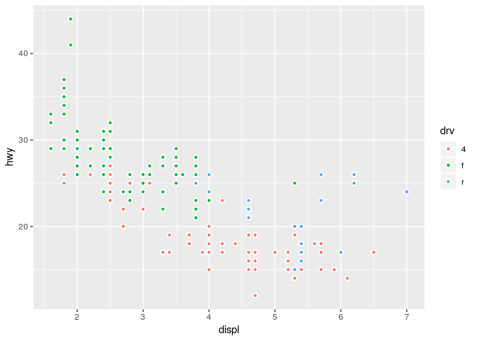

Homework 2: ggplot
================
2019-03-08

``` r
library(tidyverse)
```

    ## ── Attaching packages ──────────────────────────────────────────────────────────────────────── tidyverse 1.2.1 ──

    ## ✔ ggplot2 3.1.0       ✔ purrr   0.3.1  
    ## ✔ tibble  2.0.1       ✔ dplyr   0.8.0.1
    ## ✔ tidyr   0.8.3       ✔ stringr 1.4.0  
    ## ✔ readr   1.3.1       ✔ forcats 0.4.0

    ## ── Conflicts ─────────────────────────────────────────────────────────────────────────── tidyverse_conflicts() ──
    ## ✖ dplyr::filter() masks stats::filter()
    ## ✖ dplyr::lag()    masks stats::lag()

  - Take the first faceted plot in this section:

<!-- end list -->

``` r
ggplot(data = mpg) + 
  geom_point(mapping = aes(x = displ, y = hwy)) + 
  facet_wrap(~ class, nrow = 2)
```

<!-- -->

What are the advantages to using faceting instead of the colour
aesthetic? What are the disadvantages? How might the balance change if
you had a larger dataset?

  - Recreate the R code necessary to generate the following
graphs.

<!-- end list -->

``` r
knitr::include_graphics(paste0("plots/fig", 1:6, ".png"))
```


``` r
ggplot(mpg,aes(displ,hwy))+ 
  geom_point()+
  geom_smooth(se=FALSE)
```

    ## `geom_smooth()` using method = 'loess' and formula 'y ~ x'


``` r
ggplot(mpg,aes(displ,hwy))+ 
  geom_point()+
  geom_smooth(aes(group = drv),se=FALSE)
```

    ## `geom_smooth()` using method = 'loess' and formula 'y ~ x'


``` r
ggplot(mpg,aes(displ,hwy,color=drv))+ 
  geom_point()+
  geom_smooth(se=FALSE)
```

    ## `geom_smooth()` using method = 'loess' and formula 'y ~ x'


``` r
ggplot(mpg,aes(displ,hwy))+ 
  geom_point(aes(color=drv))+
  geom_smooth(se=FALSE)
```

    ## `geom_smooth()` using method = 'loess' and formula 'y ~ x'


``` r
ggplot(mpg,aes(displ,hwy))+ 
  geom_point(aes(color=drv))+
  geom_smooth(aes(linetype=drv),se=FALSE)
```

    ## `geom_smooth()` using method = 'loess' and formula 'y ~ x'


``` r
ggplot(mpg,aes(displ,hwy,fill=drv))+ 
  geom_point(color="white",shape=21,size=1.5,stroke=1)
```



  - Most geoms and stats come in pairs that are almost always used in
    concert. Read through the documentation and make a list of all the
    pairs. What do they have in common?

  - Compare and contrast geom\_jitter() with geom\_count().

  - What does the plot below tell you about the relationship between
    city and highway mpg (fuel consumption)? There is a linear
    relationship between city and highway fuel consumption Why is
    coord\_fixed() important? A fixed scale coordinate system forces a
    specified ratio between the physical representation of data units on
    the axes. What does geom\_abline() do?

<!-- end list -->

``` r
ggplot(data = mpg, mapping = aes(x = cty, y = hwy)) +
  geom_point() + 
  geom_abline() +
  coord_fixed()
```

<!-- -->

  - What is the default geom associated with stat\_summary()?

<!-- end list -->

``` r
#geom_pointrange
ggplot(data = diamonds) + 
  stat_summary(
    mapping = aes(x = cut, y = depth),
    fun.ymin = min,
    fun.ymax = max,
    fun.y = median
  )
```

<!-- -->

How could you rewrite the previous plot to use that geom function
instead of the stat function?

``` r
 ggplot(diamonds,aes(cut,depth))+
  geom_pointrange(stat = "summary",
                  fun.ymin = min,
                  fun.ymax = max,
                  fun.y = median)
```

<!-- --> - What does
geom\_col() do? How is it different to geom\_bar()?

  - What variables does stat\_smooth() compute? What parameters control
    its behaviour?

  - In our proportion bar chart, we need to set group = 1. Why? In other
    words what is the problem with these two graphs?

<!-- end list -->

``` r
ggplot(data = diamonds) + 
  geom_bar(mapping = aes(x = cut, y = ..prop..,group=1))
```

<!-- -->

``` r
ggplot(data = diamonds) + 
  geom_bar(mapping = aes(x = cut, fill = color, y = ..prop..,group=1))
```

<!-- -->
